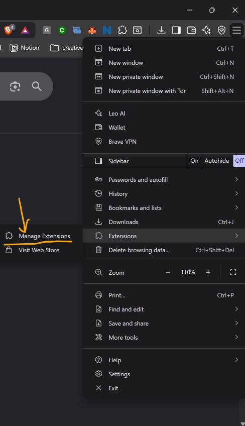
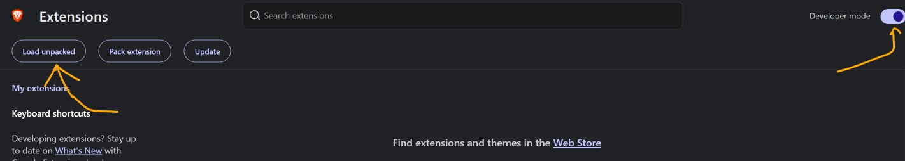
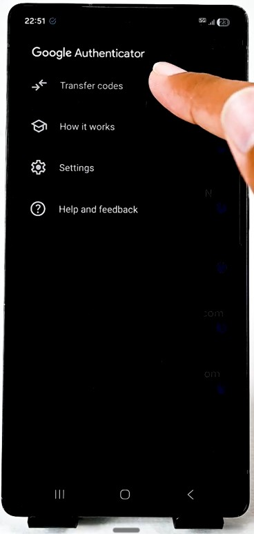
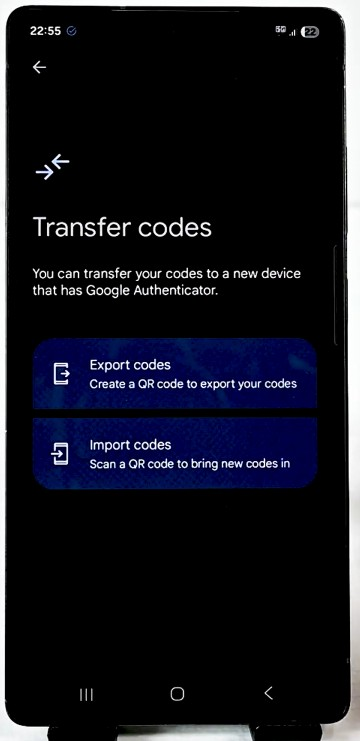
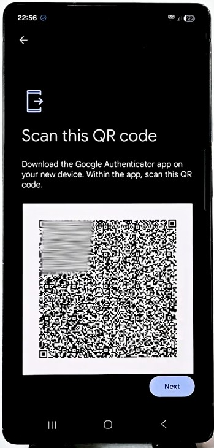

# google-authenticator-extension

### Access your Google Authenticator codes anywhere — completely offline, zero lock-in.

[Download v1.0](https://github.com/lathi-aayush/google-authenticator-extension/releases/latest) • [Report Bug](https://github.com/lathi-aayush/google-authenticator-extension/issues) • [Request Feature](https://github.com/lathi-aayush/google-authenticator-extension/issues)

 

  

 

## Install in 60 seconds 🚀

**v1.0 is live.** Install from the [GitHub Releases](https://github.com/lathi-aayush/google-authenticator-extension/releases/latest) page — download the ZIP, Load unpacked, done.

Skip the phone dance. Load once — codes live on your desktop forever after.

1. **Download the release** — grab the latest ZIP from **[Releases → v1.0](https://github.com/lathi-aayush/google-authenticator-extension/releases/latest)** and unzip it.
2. **Open Extensions** — in Chrome/Brave, go to the menu → **Extensions** → **Manage Extensions**.

   

     
   

3. **Flip the switch** — turn on **Developer mode**, then hit **Load unpacked**.

   

     
   

4. **Select the unzipped folder** — pick the folder that contains `manifest.json` (the packaged extension root).

That’s it. Your desktop just got a phone-free authenticator.

Prefer installing from source?

Clone the repo, then Load unpacked on the nested [`google-authenticator-extension/`](https://github.com/lathi-aayush/google-authenticator-extension/tree/main/google-authenticator-extension) folder (the one with `manifest.json` — **not** the repo root).

---

## How it works ⚡

No cloud account. No subscription. No mystery server. Export from your phone, import once, codes refresh locally forever.

<table>
  <tr>
    <td align="center" width="33%">
      
       
      <b>Tap Transfer codes</b>
       
      Open the side door in Google Authenticator
    </td>
    <td align="center" width="33%">
      
       
      <b>Hit Export codes</b>
       
      Package the accounts you actually need
    </td>
    <td align="center" width="33%">
      
       
      <b>Grab the QR</b>
       
      Screenshot it — or decode the migration link
    </td>
  </tr>
</table>

Drop that QR screenshot (or paste the `otpauth-migration://` link) into the extension popup — live codes appear instantly.

---

## Why this exists 💡

Dead phone battery. Desk too far. Login screen waiting. Traditional authenticator apps trap your secrets in a mobile walled garden — desktop work shouldn’t depend on that.

**google-authenticator-extension** is the escape hatch: a lightweight, zero-latency desktop companion that reads Google Authenticator’s native export payloads offline. Stay in flow. Keep your keys yours.

---

## What you can do with it ✨

* **One-click copy** — tap a live code, paste it into any login in seconds.
* **Dual import** — upload a QR screenshot or paste a migration link — your call.
* **Air-gapped by design** — 100% offline generation, zero network requests.
* **Multi-account in one shot** — import a whole export batch at once.
* **Never miss the window** — countdown tickers so you never copy an expired code.

---

## Built for people who move fast 🎯

### Who is this for?

* **Power users & developers** — stop picking up your phone 20 times a day for dashboards and staging logins.
* **Multi-device workers** — keep 2FA on your primary workstation, not locked to one handset.
* **Privacy-first builders** — no third-party cloud sync holding your master keys.

| Without this extension | With google-authenticator-extension |
| --- | --- |
| Reaching for your phone every login | **Instant desktop codes in 1 click** |
| Locked to a single phone screen | **Codes where you actually work** |
| Locked out when the phone dies | **Local backup of your TOTP accounts** |
| Secrets on someone else’s cloud | **100% offline, browser-only storage** |

---

## Libraries & Credits 🛠️

* **[ZXing JS](https://github.com/zxing-js/library)** (`zxing.min.js`) — Offline QR decoding, bundled in the package so nothing phones home.

## Footer 📄

Distributed under the MIT License. See `LICENSE` for more information.

Want to contribute or suggest a feature? Open an issue or pull request on GitHub.

Created with ❤️ for faster, friction-free authentication.
