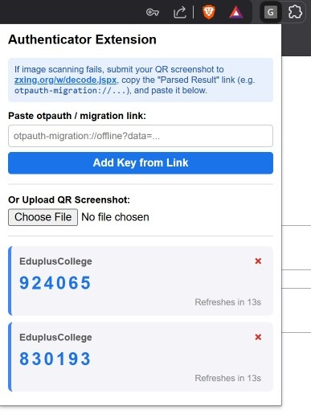

# google-authenticator-extension

### Access your Google Authenticator codes anywhere — completely offline, zero lock-in.

[Demo](#) • [Report Bug](https://github.com/your-username/google-authenticator-extension/issues) • [Request Feature](https://github.com/your-username/google-authenticator-extension/issues)

 

  

 

## Why this exists 💡

Getting locked out of your accounts because your phone battery died, or constantly reaching across your desk just to grab a 6-digit code during a busy workday, is unnecessarily frustrating. Traditional Authenticator apps lock your secrets inside a mobile walled garden, making desktop workflows feel clunky and slow. 

**google-authenticator-extension** breaks down those walls. It gives you a lightweight, zero-latency desktop companion that decodes Google Authenticator's native export payloads instantly — keeping you in flow without ever compromising your privacy.

---

## How it works ⚡

You don't need a cloud account, a subscription, or a background service running on a remote server. Everything happens on your machine in real time.

1. **Exports native QR payloads** directly from your phone's Google Authenticator app.
2. **Parses raw binary data offline** using custom, light-speed Protobuf decoding inside your browser.
3. **Generates live TOTP codes** locally using web-native, hardware-accelerated cryptography.
4. **Keeps your keys private** — no data ever leaves your local browser storage.

---

## App flow 🗺️

1. **Export your accounts** — Open Google Authenticator on your phone, choose **Transfer Accounts**, and select **Export**.
2. **Import in one click** — Snap a screenshot of the QR code or copy the `otpauth-migration://` link directly into the browser extension.
3. **Get instant 2FA access** — Click any code to copy it to your clipboard with a single tap, exactly when you need it.

---

## What you can do with it ✨

* **One-Click Code Copying** — Tap any live code to copy it straight to your clipboard and fill out logins in seconds.
* **Dual Import Methods** — Drag-and-drop a QR screenshot or paste a raw migration link — whichever is faster for you.
* **Air-Gapped Privacy** — Enjoy 100% offline generation with zero network requests and absolute peace of mind.
* **Multi-Account Support** — Import multiple accounts at once from a single migration export seamlessly.
* **Auto-Sync Ticker** — Watch visual countdown timers update every 30 seconds so you never copy an expired code.

---

## Why you should be using it 🎯

### Who is this for?

* **Power Users & Developers** — Stop picking up your phone 20 times a day just to log into console dashboards, staging environments, and tools.
* **Multi-Device Workers** — Keep your two-factor codes readily accessible on your primary workstation without depending on a single physical phone.
* **Privacy Conscious Techies** — Anyone who refuses to trust third-party cloud sync services with their master 2FA keys.

| Without this extension | With google-authenticator-extension |
| --- | --- |
| Reaching for your phone every time you log in | **Instant desktop code generation in 1 click** |
| Locked into a single mobile phone screen | **Seamless cross-device capability** |
| Fear of getting locked out if your phone breaks | **Safe, local backup of your TOTP accounts** |
| Data synced through third-party cloud servers | **100% offline, local-only browser storage** |

---

## Libraries & Credits 🛠️

* **[ZXing JS](https://github.com/zxing-js/library)** (`zxing.min.js`) — Used client-side for offline QR code decoding and image parsing. Included directly in the extension package to ensure zero external network dependencies.

## Footer 📄

Distributed under the MIT License. See `LICENSE` for more information.

Want to contribute or suggest a feature? Feel free to open an issue or pull request on GitHub!

Created with ❤️ for a faster, friction-free web.